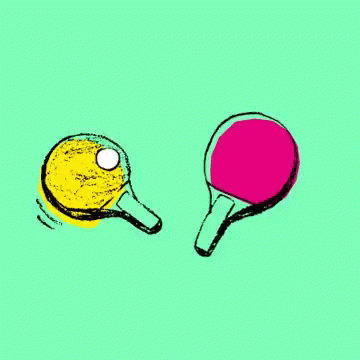

# Assignment 00 - PingPongColorChanger

## Overview
Your task in this assignment is to turn orange ping pong balls in to different colors. In the output image, the background should be maintained. Input images are in the `assets/` directory.

## Rubric
| Points | Task |
| ------ | ----------- |
| 15     | Define a class named `PingPongColorChanger` |
| 15     | Constructor accepts an `image` |
| 35     | Method, `change_color` accepts a BGR color tuple and returns `output` |
| 5      | Create other re-usable methods as necessary |
| 10      | Test code in (a) Jupyter block if using Colab or (b) in `"__main__"` at the bottom of the script. Test code instantiates your class and utilizes the methods. Test code turns the ping pong balls 3 different colors and produces output images.  |
| 15     | Background is preserved |
| 5      | Code is well-commented |
| 5 ***b*** | ***Bonus***: Code works on all 4 test images in the `assets/` directory |